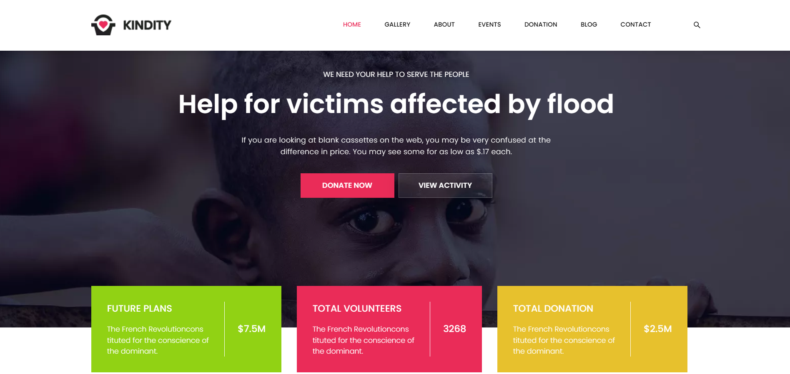
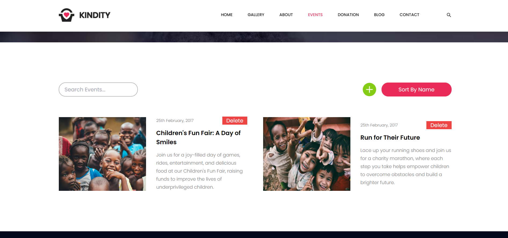
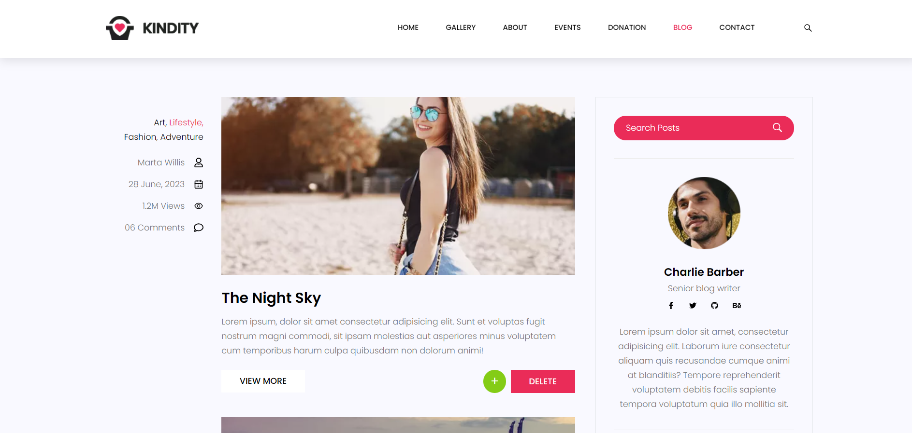

# Kindity

Kindity is a donation platform that allows users to donate to various projects.

## Description

Kindity is a full-stack web application designed to showcase CRUD operations, responsive design, dynamic detail pages, filtering, sorting, and user authentication (login \& registration). The platform ensures a seamless user experience while managing donations efficiently.  

## Installation

1. Clone the repository:
    ```sh
    git clone https://github.com/yourusername/kindity.git
    ```
2. Navigate to the project directory:
    ```sh
    cd back
    &&
    cd front
    ```
3. Install the dependencies:
    ```sh
    npm install
    ```

## Usage

1. Start the development server:
    ```sh
    nodemon server.js (front)
    npm run dev (back)
    ```
2. Open your browser and navigate to `http://localhost:5173`.

## Screenshots from the project


