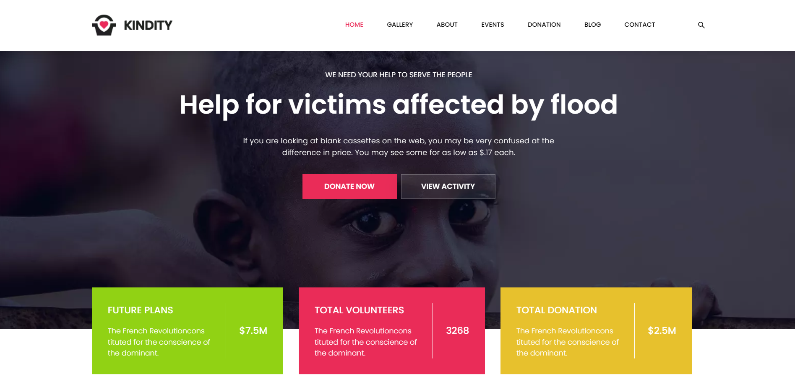
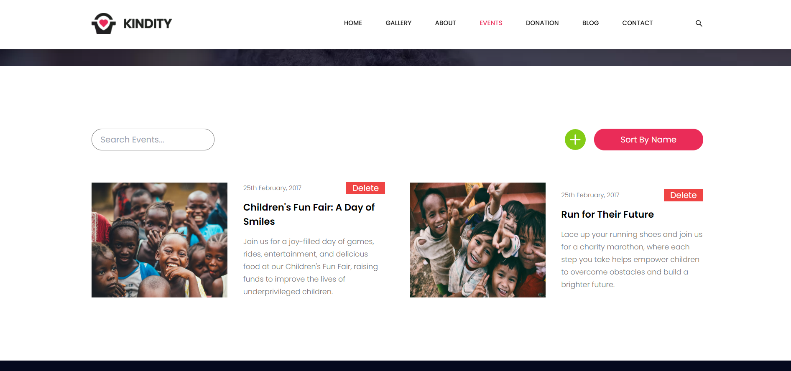
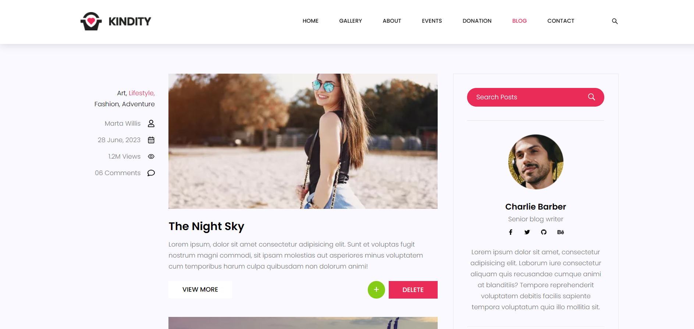

# Kindity

Kindity is a full-stack charity and donation demonstration built with React, Express, and MongoDB. Visitors can browse community projects, events, stories, and a gallery. Registered users can edit their profiles, make Stripe card donations in USD, and view their donation history; administrators can create events and stories and view donations across users.

The supplied stories, events, testimonials, and impact figures are illustrative demo content. The contact page does not provide a monitored contact channel. Some admin publishing features are incomplete; see [Known limitations](#known-limitations).

## Stack and architecture

| Area | Implementation |
| --- | --- |
| Frontend | React 18, Vite 4, React Router 6, Tailwind CSS, Material UI, Axios, React Hook Form, Yup |
| Backend | Express 4, TypeScript, Mongoose 7, MongoDB |
| Authentication | bcrypt password hashing and a one-day JWT in an HTTP-only `token` cookie |
| Payments | Stripe Payment Intents, React Stripe Elements, signed webhooks |
| Testing | Jest, Supertest, mongodb-memory-server, Playwright, Ajv API schema checks |

The browser calls the API at `VITE_API_URL`, with Axios configured to send cookies. Express loads content and account data from MongoDB and checks user/admin access on protected endpoints. Payment confirmation happens through Stripe; the success webhook creates the donation-history record.

```text
back/
  app.ts                 Express middleware and mounted routes
  server.ts              MongoDB connection and HTTP listener
  controllers/           Content, authentication, users, and payments
  middleware/            Cookie authentication and admin checks
  models/                Mongoose schemas
  routes/                API routes, including legacy content routes
  scripts/               Seed data and demo-content migration
  tests/                 Jest unit and integration tests
front/
  context/               Session state and profile loading
  src/pages/             Public, account, and admin pages
  src/components/        Shared UI and route guards
  src/content/           Shared public copy
tests/                   Playwright API/UI suites and fixtures
docs/qa/                 Test plan, defect records, and release checklist
.github/workflows/       GitHub Actions test workflow
```

`back`, `front`, and `tests` each have their own package manifest and lockfile. There is no root npm workspace. Only routes mounted in [back/app.ts](back/app.ts) are active; a file in `back/routes/` alone does not expose an endpoint.

## Local setup

### Prerequisites

- Node.js and npm. The checked-in CI workflow uses Node.js **20.x**; the packages do not declare a Node engine constraint.
- A reachable MongoDB instance. CI uses **MongoDB 7**.
- Stripe test credentials only if you want to exercise actual test payments.

Commands below use PowerShell and start from the repository root unless stated otherwise. `npm.cmd` and `npx.cmd` avoid PowerShell script execution-policy issues; on other shells, use `npm` and `npx` with the equivalent file-copy and environment-variable syntax.

### Install and configure

Copy the examples without overwriting existing configuration, then install both application packages:

```powershell
if (!(Test-Path back/.env)) { Copy-Item back/.env.example back/.env }
if (!(Test-Path front/.env)) { Copy-Item front/.env.example front/.env }
npm.cmd ci --prefix back
npm.cmd ci --prefix front
```

Edit `back/.env`: set `DB_URL` to your development database and replace `JWT_SECRET` with a private, long random value **before starting the backend**. Keep secrets out of Git. Leave the frontend's example Stripe value in place when browsing without payments; it is only a placeholder.

Start your local MongoDB service, or, if Docker is installed, create a development instance with persistent storage:

```powershell
docker run -d --name kindity-mongo -p 27017:27017 -v kindity-mongo-data:/data/db mongo:7
```

On subsequent runs, use `docker start kindity-mongo` instead of creating the container again.

### Seed demo content

An empty database has no stored page content. To populate it and create development accounts:

```powershell
npm.cmd run seed --prefix back
```

| Role | Default email | Default password |
| --- | --- | --- |
| Admin | `admin@kindity.test` | `admin123` |
| User | `user@kindity.test` | `user123` |

Use these accounts only in development/test databases. Override them with `SEED_ADMIN_EMAIL`, `SEED_ADMIN_PASSWORD`, `SEED_USER_EMAIL`, and `SEED_USER_PASSWORD` in `back/.env` or the process environment.

The seed fills each content collection only when that collection is empty. **Every run also resets the seeded accounts' names, roles, and passwords**, including existing accounts matching those emails. It does not upgrade existing content. For older fixtures, use the separate dry-run migration described in the [content release checklist](docs/qa/content-release.md).

### Start the application

In one terminal:

```powershell
npm.cmd run dev --prefix back
```

In another terminal:

```powershell
npm.cmd run dev --prefix front
```

Open [http://localhost:5173](http://localhost:5173). The API defaults to [http://localhost:3000](http://localhost:3000) and starts listening only after MongoDB connects. Check it with:

```powershell
Invoke-RestMethod http://localhost:3000/api/events
```

Account pages are `/profile` and `/donations`; the admin donation dashboard is `/admin/dashboard`, with content creation at `/addEvent` and `/addNews`. Log in through `/login` or create a regular user through `/register`.

## Configuration

### Backend: `back/.env`

| Variable | Purpose / example |
| --- | --- |
| `PORT` | API port; defaults to `3000` |
| `DB_URL` | Required MongoDB URI, e.g. `mongodb://localhost:27017/kindity` |
| `JWT_SECRET` | Required secret for signing and verifying sessions |
| `CLIENT_URL` | Allowed browser origin with credentials; defaults to `http://localhost:5173` |
| `NODE_ENV` | Use `development` locally; `production` enables secure auth cookies |
| `STRIPE_SECRET_KEY` | Stripe secret key; use an `sk_test_...` value for development payments |
| `STRIPE_WEBHOOK_SECRET` | Signing secret for the webhook endpoint, `whsec_...` |

### Frontend: `front/.env`

| Variable | Purpose / example |
| --- | --- |
| `VITE_API_URL` | API origin without a trailing slash, e.g. `http://localhost:3000`; do not append `/api` |
| `VITE_STRIPE_PUBLISHABLE_KEY` | Matching Stripe publishable key, `pk_test_...` |

Frontend `VITE_` values are exposed to the browser and embedded at build time. Never put a Stripe secret key or `JWT_SECRET` there. Restart development servers after changing environment files; rebuild the frontend after changing deployment values.

### Stripe donation flow

1. Configure matching Stripe test secret/publishable keys and log in to Kindity.
2. Forward Stripe test webhook events to `http://localhost:3000/api/payment/webhook`, and set `STRIPE_WEBHOOK_SECRET` to the signing secret for that endpoint or forwarding session.
3. Submit a donation at `/donation`. The client sends `{ "amount": 25 }` for a USD 25 donation to `/api/payment/create-payment-intent`; the backend accepts positive numeric amounts up to USD 10,000 with at most two decimal places and converts dollars to cents.
4. Stripe Elements confirms the card payment. The signed `payment_intent.succeeded` webhook uses `metadata.userId` to save the donation, which appears at `/donations` and in the admin dashboard.

Browsing and authentication do not require working Stripe credentials. Placeholder keys cannot process payments. A successful browser confirmation alone does not save donation history; webhook delivery and database persistence must also succeed. Webhook persistence failures return `500` for retry, while duplicate deliveries for an already-saved Stripe payment return success without creating another donation.

## API overview

Paths below are relative to `VITE_API_URL`. Authentication uses the `token` cookie, not a bearer-token header. Protected routes return `401` without a valid session; admin middleware returns `403` for a signed-in non-admin.

| Method | Path | Access / purpose |
| --- | --- | --- |
| `POST` | `/register` | Public; `{ name, email, password }`, creates a regular user and session |
| `POST` | `/login` | Public; `{ email, password }`, creates a session |
| `POST` | `/logout` | Clears the session cookie |
| `GET` | `/profile` | Signed-in user's current profile |
| `GET` | `/api/home-content`, `/api/about`, `/api/blog` | Public aggregated page content |
| `GET` | `/api/events`, `/api/events/:id` | Public event list/detail |
| `POST` | `/api/events` | Admin; creates an event from `{ img, header, desc }` |
| `GET` | `/api/news/:id` | Public story detail |
| `POST` | `/api/news` | Admin; creates a story from `{ header, desc, img, category1, category2, category3, category4, user }` |
| `GET` | `/api/gallery` | Public gallery images |
| `PUT` | `/api/users/profile` | Signed-in user; updates name/email |
| `GET` | `/api/users/donations` | Signed-in user's donation history |
| `GET` | `/api/admin/donations` | Admin; all donations with donor name/email |
| `POST` | `/api/payment/create-payment-intent` | Signed-in user; amount in USD, returns `clientSecret` |
| `POST` | `/api/payment/webhook` | Stripe signature verification; receives the raw JSON body |
| `GET` | `/kindity/donation`, `/kindity/contact` | Public legacy page-content records |
| `POST` / `PUT` / `DELETE` | `/kindity/donation`, `/kindity/contact` | Admin content writes; `PUT`/`DELETE` append `/:id` |

Login allows 20 failed attempts per client IP within 15 minutes; further attempts return `429`. Successful logins do not consume that allowance.

The legacy donation/contact endpoints manage page content, not payments or incoming contact messages. Example cookie-based API session after seeding:

```powershell
$login = @{ email = 'user@kindity.test'; password = 'user123' } | ConvertTo-Json
Invoke-RestMethod -Method Post -Uri http://localhost:3000/login -ContentType 'application/json' -Body $login -SessionVariable kinditySession
Invoke-RestMethod -Uri http://localhost:3000/api/users/donations -WebSession $kinditySession
```

## Tests and checks

### Backend tests

```powershell
npm.cmd test --prefix back
npm.cmd run test:ci --prefix back
```

Jest uses Supertest and a temporary MongoDB process from `mongodb-memory-server`; a separately running application/database is not required. The first run may download a MongoDB binary and requires its platform runtime dependencies. `test:ci` adds coverage in `back/coverage/`.

### Playwright API and browser tests

Keep MongoDB running, but stop manually started frontend/backend servers before running this suite. Playwright starts both servers and seeds the database from `tests/.env`; locally, it reuses servers on the configured URLs if they already exist, which can accidentally target a different database or configuration.

Prepare the test package:

```powershell
if (!(Test-Path tests/.env)) { Copy-Item tests/.env.example tests/.env }
npm.cmd ci --prefix tests
Push-Location tests
npx.cmd playwright install chromium
Pop-Location
```

Review `tests/.env` before running. Use a dedicated disposable database such as the example `mongodb://127.0.0.1:27017/kindity_test`; seeding updates test-account credentials and tests write records. `API_URL` and `FRONT_URL` default to ports `3000` and `5173`, matching the ports used by the test server commands. Keep these defaults unless you also adjust the server configuration.

Stripe-dependent tests skip when the example test keys are used. Signed webhook tests can run with the dummy credentials. Set matching real **test-mode** keys in `tests/.env` to include Stripe API/card tests.

Run the complete suite, or select API/UI checks:

```powershell
npm.cmd test --prefix tests
npm.cmd run test:api --prefix tests
npm.cmd run test:ui --prefix tests
npm.cmd run test:headed --prefix tests
npm.cmd run report --prefix tests
```

For the public-content UI checks without MongoDB or the backend:

```powershell
$env:CONTENT_MOCK_MODE = '1'
try {
    npm.cmd run test:ui --prefix tests -- content.spec.ts
} finally {
    Remove-Item Env:CONTENT_MOCK_MODE
}
```

This mode mocks content responses and must be limited to `content.spec.ts`; it does not verify live API/database behavior. Playwright writes its HTML report to `tests/playwright-report/` and failure screenshots, traces, and videos to `tests/test-results/`.

Regression tests cover the resolved authentication, publishing, payment, and error-handling defects. A green run can still include skipped payment tests when Stripe test credentials are absent. See the [QA guide](docs/qa/README.md), [test plan](docs/qa/test-plan.md), and [traceability matrix](docs/qa/traceability-matrix.md).

The [GitHub Actions workflow](.github/workflows/test.yml) runs on pushes and pull requests to `main`, plus manual dispatch. It builds both packages, runs backend coverage, checks Playwright TypeScript, runs API/UI tests against MongoDB 7, and uploads test artifacts.

## Build and deployment

```powershell
npm.cmd run build --prefix back
npm.cmd run build --prefix front
```

The backend compiles to `back/dist/`; run it with `npm.cmd start --prefix back` after setting the backend environment and making MongoDB available. The frontend builds to `front/dist/`; serve that directory with a static host configured to fall back to `index.html` for React Router paths. `npm.cmd run preview --prefix front` provides a local build preview. The frontend also provides `npm.cmd run lint --prefix front` for ESLint checks.

Set `VITE_API_URL` before building and set `CLIENT_URL` to the exact frontend origin. Production auth cookies require HTTPS and use `SameSite=None; Secure`; development/test cookies use `SameSite=Strict` without `Secure`. Browsers that block third-party cookies may still block sessions across separate sites. Keep the Stripe webhook route ahead of global JSON parsing, as in `back/app.ts`, so signature verification receives the raw request body.

The login rate limiter stores counters in memory per server process. Multiple replicas need a shared store for a combined allowance; reverse-proxy deployments need Express trust-proxy configuration matching their topology. See [BUG-10's resolution](docs/qa/issues/BUG-10.md).

Use the [content release checklist](docs/qa/content-release.md) for demo-content replacement, migration review, and rollback. The repository includes CI, but no automated deployment workflow.

## Known limitations

Event/news delete controls call `/api/events/:id` and `/api/news/:id`, but these routes have no mounted delete handlers. Deletion returns `404`; admin event/story creation is supported.

The [defect records](docs/qa/issues/) include historical findings as well as current limitations. Consult the implementation and active tests for current status.

## Troubleshooting

| Symptom | Check |
| --- | --- |
| API does not listen on port 3000 | MongoDB must connect first. Check `DB_URL`, database availability, and backend logs. If local name resolution fails, try `127.0.0.1` in the MongoDB URI. |
| Pages have empty content | Seed the database used by the running backend; existing nonempty collections are skipped. |
| Browser reports network/CORS errors | Match `VITE_API_URL`, the actual API port, and `CLIENT_URL`. If Vite chooses another port, free port 5173 or update the allowed origin. |
| Login works but session is missing | Check the frontend origin, cookie settings, HTTPS in production, and browser third-party-cookie policy. Use a consistent hostname locally. |
| Login returns `429` | The failed-login allowance has been reached; wait for the interval indicated by `Retry-After`. |
| Donation succeeds but history stays empty | Verify webhook delivery, signing secret, `payment_intent.succeeded`, and backend database logs. |
| Jest cannot start its database | Check MongoDB binary download access and platform runtime requirements. Prior Windows runtime/native-resolver issues are recorded in the [release checklist](docs/qa/content-release.md). |

## Screenshots




